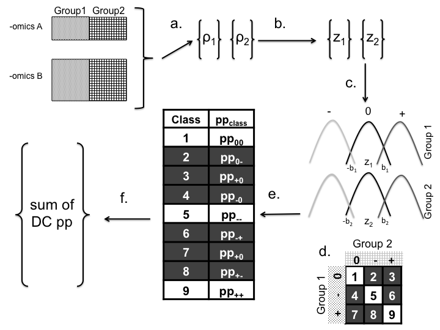

# User's Guide

###Contents

1. Introduction
2. Preliminaries
    + Citing Discordant  
    + Installation
3. Quick Start
    + Brief Introduction
    + Required Inputs
    + Example Run
4. Brief Summary of Algorithm
5. Outline of Analysis
    + Create Correlation Vectors
    + Run Discordant Algorithm
    + Make Table to Summarize Results

### 1. Introduction

"Discordant" is an R package that identifies pairs of features that correlate differently between phenotypic groups, with application to -omics datasets. Discordant uses a mixture model that “bins” molecular feature pairs based on their type of coexpression. More information on the algorithm can be found in Siska, et. al (submitted). The final output are posterior probabilities of differential correlation. This package can be used to determine differential correlation within one –omics dataset or between two –omics datasets (provided that both –omics datasets were taken from the same samples). Also, the type of data can be any type of –omics, such as metabolomics, transcriptomic, proteomics, etc. as long as the data are continuous (numerical) rather than discrete (categorical, count).

The functions in the "Discordant package" provide a simple pipeline for intermediate R users to determine differentially correlated pairs. The final output is a table of molecular feature pairs and their respective posterior probabilities. Functions have been written to allow flexibility for users in how they interpret results, which will be discussed further. Currently, the package only supports the comparison between two phenotypic groups (e.g., disease vs control, mutant vs wildtype).

The Discordant method uses C code, which has been shown to compile on Linux. The C code is not able to compile on OSX Yosemite, however testing has not expanded to other operating systems.

### 2. Preliminaries

**Citing Discordant**

"Discordant" is originally derived from the Concordant algorithm written by Lai, et. al. When citing Discordant, please also include Lai, et. al in references.

Lai, Y., Adam, B. -l., Podolsky, R., and She, J.-X. (2007). A mixture model approach to the tests of concordance and discordance between two large-scale experiments with two-sample groups. Bioinformatics 23, 1243–1250.

Siska C., Bowler R.P and Kechris K. (2015). The Discordant Method: A Novel Approach to Differential Correlation. Bioinformatics. Submitted with Major Revisions.

**Installation**

Open directory that contains files discordant.R and discordant.C. First compile C code for R. Open a terminal window and run the following line

```
R CMD SHLIB discordant.c
```

This will create another file, discordant.so.

Next, open R in the same directory. To load the Discordant method, enter the following line of code.

```
source("discordant.R")
```

Now all functions should be loaded into R for use.

### 3. Quick workflow

**Brief Introduction**

Single –omics refers to when the Discordant analysis is performed within one –omics dataset. This means that all molecular features are analyzed to each other, rather than separating them by molecular type. This is mainly applicable to one –omics dataset, such as a single microarray experiment.

Dual -omics refers to when the Discordant analysis is performed with two -omics datasets. Molecular feature pairs analyzed are between the two -omics, i.e. transcript-protein, protein-metabolite, etc.

**Required Inputs**

`x`     
m by n matrix where m are features and n are samples.

`y`  
m by n matrix where m are features and n are samples. Optional, will induce dual -omics analysis. Samples must be matched with those in x.

`groups`  
vector which describes which group each sample belongs to using 1s and 2s

**Example run**

Load data into R.

```
load("TCGA_GBM_miRNASample.RData") # loads matrix called TCGA_GBM_miRNASample
load("TCGA_GBM_transcriptSample.RData") # loads matrix called TCGA_GBM_transcriptSample
```

Determine groups in omics data.

```
groups <- c(rep(1,10), rep(2,10))
```

*Single -omics analysis*

```
vectors <- createVectors(TCGA_GBM_transcriptSample, groups = groups)
result <- discordantRun(vectors$v1, vectors$v2, TCGA_GBM_transcriptSample)
resultTable <- makeTable(result$discordPPMatrix, TCGA_GBM_transcriptSample)
```

*Dual -omics analysis*

```
vectors <- createVectors(TCGA_GBM_transcriptSample, TCGA_GBM_miRNASample, groups = groups)
result <- discordantRun(vectors$v1, vectors$v2, TCGA_GBM_transcriptSample, TCGA_GBM_miRNASample)
resultTable <- makeTable(result$discordPPMatrix, TCGA_GBM_transcriptSample, TCGA_GBM_miRNASample)
```

###4. Summary of Algorithm

Using a three component mixture model and the EM algorithm, the model predicts if the correlation coefficients in phenotypic groups 1 and 2 for a molecular feature pair are dissimilar. The correlation coefficients are generated for all possible molecular feature pairs between -omics A and -omics B (Figure 1a) and are transformed in to z scores using Fisher's tranformation (Figure 1b). The three components are -, + and 0 which correspond respectively to a negative, positive or no correlation (Figure 1c). Molecular features that have correlation coefficients in *different* components are considered *differentially* correlated, as opposed when correlation coefficients are in the *same* component they are *equivalently* correlated.



<<<<<<< HEAD
######## Figure 1. Discordant Algorithm pipeline. a. Determine Pearson’s correlation coefficients for all A and B pairs. b. Fisher’s transformation c. Mixture model based on z scores d. Class matrix describing between group relationships e. EM Algorithm to estimate posterior probability of each class for each pair f. Identify features of –omics A and B that have high pp of DC.
=======
Figure 1. Discordant Algorithm pipeline. a. Determine Pearson’s correlation coefficients for all A and B pairs. b. Fisher’s transformation c. Mixture model based on z scores d. Class matrix describing between group relationships e. EM Algorithm to estimate posterior probability of each class for each pair f. Identify features of –omics A and B that have high pp of DC.
>>>>>>> 2c4a5b4ce95a9ed7131e75741c42cbbbac4f1355

The class matrix (Figure 1d) are the classes that represent all possible paired-correlation scenarios. These scenarios are based off the components in the mixture models. Molecular features that have correlation coefficients in *different* components are considered *differentially* correlated, as opposed to when correlation coefficients are in the *same* component they are *equivalently* correlated. This can be visualized in the class matrix, where the rows represent the components for group 1 and the columns represent the components for group 2. The classes on the diagonal represent equivalent correlation, and classes in the off-diagonal represent differential correlation.

After running the EM algorithm, we have 9 posterior probabilities for each molecular feature pair (Figure 1e) that correspond the the 9 classes in the class matrix. Since we want to summarize the probability that the molecular feature pair is differentially correlated, we sum the posterior probabilities representing the off-diagonal classes in the class matrix (Figure 1f).


###5. Outline of Analysis

**Create Correlation Vectors**

To run the Discordant algorithm correlation vectors respective to each group are necessary for input, which are easy to create using the function `createVectors`. Each correlation coefficient represents the linear correlation between two molecular features. The molecular features depend if a single -omics or dual -omics analysis has been performed. Correlation between molecular features in the same -omics dataset is single -omics, and correlation between molecular features in two different -omics datasets is dual -omics. Whether or not single -omics or dual -omics analysis is performed depends on whether one or two matrices are parameters for this function.

The other parameter is `groups`, which is a vector containing 1s and 2s that correspond to the location of samples in the column of the matrix for group 1 and group 2. For example, the control group is group 1 and the experimental group 2, and the location of samples corresponding to the two groups matches the locations of 1s and 2s in the group vector.

Single -omics
```
vectors <- createVectors(TCGA_GBM_transcriptSample, groups = groups)
```

Dual -omics
```
vectors <- createVectors(TCGA_GBM_transcriptSample, TCGA_GBM_miRNASample, groups = groups)
```

createVectors has two outputs:

`v1`  
Correlation vector of molecular feature pairs corresponding to samples labeled 1 in group parameter.

`v2`  
Correlation vector of molecular feature pairs corresponding to samples labeled 2 in group parameter.


**Run Discordant Algorithm**

The Discordant Algorithm is in the function `discordantRun` requires two correlation vectors and the original data. If the user wishes to generate their own correlation vector before inputting into the dataset, they can do so. However, the function will break if the dimenions of the datasets inserted do not match the correlation vector.

The posterior probability output of the Discordant algorithm are the summed DC posterior probabilities (those in the off-diagonal of the class matrix described in Section 4). If the user wishes to observe the posterior probabilities differently, a matrix with the posterior probability of each class for each molecular feature pair is also available. 

Single -omics
```
result <- discordantRun(vectors$v1, vectors$v2, TCGA_GBM_transcriptSample)
```

Dual -omics
```
result <- discordantRun(vectors$v1, vectors$v2, TCGA_GBM_transcriptSample, TCGA_GBM_miRNASample)
```

**Make Table to Summarize Results**

To ease the user in determining the posterior probability for each pair, the function `makeTable` was included. The only parameters required is the matrix of summed up discordant posterior probabilities from `discordantRun` and the data matrices.

Single -omics
```
resultTable <- makeTable(result$discordPPMatrix, TCGA_GBM_transcriptSample)
```

Dual -omics
```
resultTable <- makeTable(result$discordPPMatrix, TCGA_GBM_transcriptSample, TCGA_GBM_miRNASample)
```
